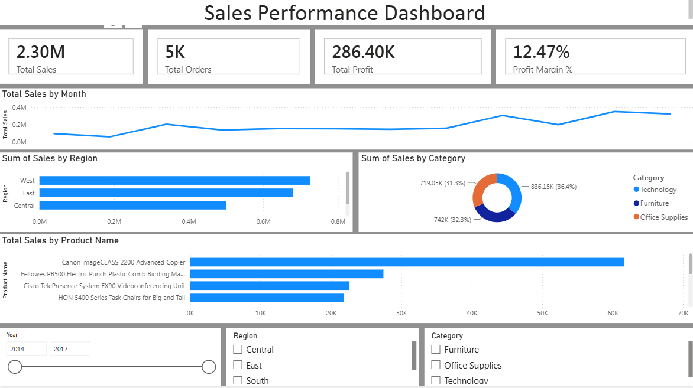

# Sales Performance Dashboard

## Overview
Interactive Power BI dashboard built using the Superstore dataset.

## Features
- Total Sales KPI
- Total Profit KPI
- Total Orders KPI
- Profit Margin %
- Monthly Sales Trend
- Sales by Region
- Sales by Category
- Top Products Analysis
- Interactive Slicers

## Tools Used
- Power BI Desktop
- Power Query
- DAX
- Excel

## DAX Measures
- Total Sales
- Total Profit
- Total Orders
- Profit Margin %

## Dashboard Preview

## Files
- Sales_Performance_Dashboard.pbix
- Dashboard_Screenshot.png
